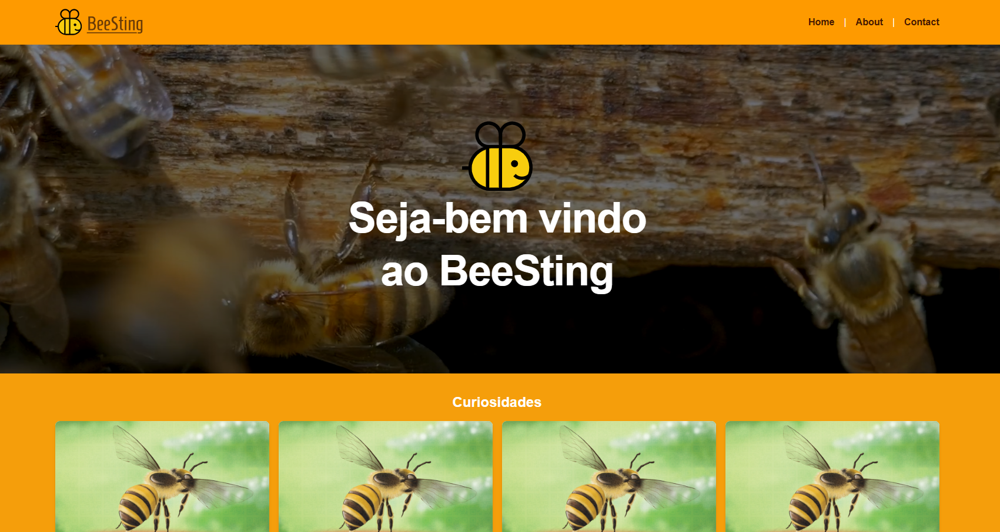

# React + TypeScript + Vite + Testing Library

**💬 About.** 

Projeto sobre abelhas.

**👇 Follow the steps.** 

```bash
git clone git@github.com:Helton-Carlos/chapter.git
```

### **Iniciar projeto**
```bash
cd react-full
```

```bash
npm install
```

### **Rodar em ambiente DEV**

```bash
npm run dev
```

### **Para testar aplicação**

```bash
npm run test
```


